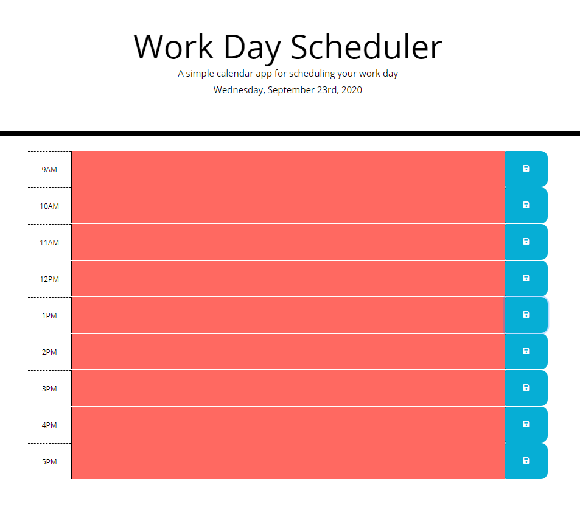

# Work-Day-Scheduler

The work day scheduler allows the user to enter hourly work tasks and save them to local storage. When the page is refreshed, the hourly tasks remain on the page. The date is updated dynamically. The color of the hourly work task rows is updated dynamically based the time of the day. 
The page can be found on GitHub at [Work-Day-Scheduler](https://jrtwheeler.github.io/Work-Day-Scheduler/).
- Javascript
- HTML
- JQUERY
- CSS

